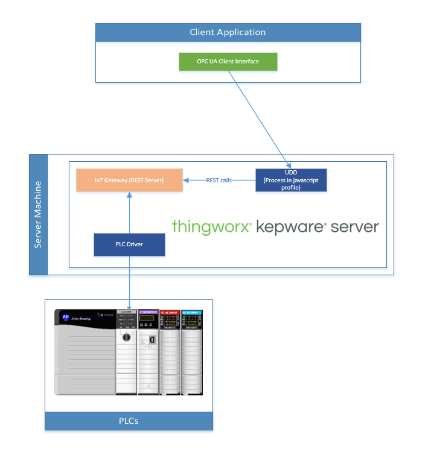

# Data Pre-processing with IoT Gateway

These profiles provide templates to that can preprocess data from within Kepware. It profile creates an HTTP client to access the IoT Gateway REST server and read tag data in Kepware. It then processes the values and updates tags within the UDD driver. The HTTP functionality is from the [HTTP-REST](../../HTTP-REST/) examples.

This data flow is useful for scenarios where caluclations or data processing needs can't be accomplished in Kepware's Advanced Tags Plug-in. See diagram below for data flow:

## Requirements

- Kepware versions 6.11 or higher that support the UDD v2.0 profile
- IoT Gateway REST server functionality in Kepware

## Examples

### Generic Preprocess Examnple

A generic example to be used as a starting point for building a unique solution. Example implements a simple part counter based on a boolean trigger and remaps string formatted status codes to integer numeric codes based on a simple look up.

### DPM Pacemaker Preprocess Example

Example specifically designed around the expected property outputs for the [Digital Performance Manager (DPM)](https://www.ptc.com/en/products/digital-performance-management)  solution in Thingworx. The output tags are prebuilt for these properties and example use case data processing is provided for reference.
